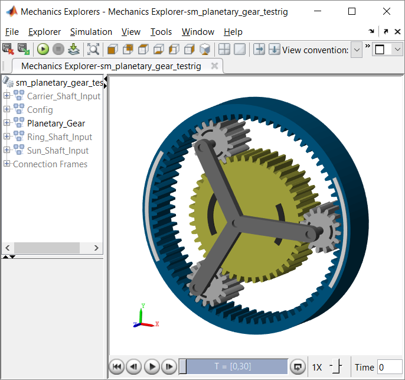

# **Simscape Multibody Parts Library**
Copyright 2017-2023 The MathWorks(TM), Inc.

View on File Exchange:   
You can also open in MATLAB Online: 

This set of examples shows you how to create parameterized parts for Simscape Multibody
and example MATLAB scripts for defining general extrusions.  The parts have been used in a 
wide range of examples to show how these blocks enable you to rapidly model mechanisms.
Consistent orientation of frames at the interfaces make it easy to combine them.

Open the project by double-clicking on Multibody_Parts_Library.prj

Within the Simscape Multibody Parts Library, you will find parameterized gear assemblies.
The gear constraint blocks require that other constraints in the mechanism correctly position 
and orient the frames associated with the gear constraint.  The library blocks group
the required blocks together and parameterize them so that frames are always in the right place.  
There are many ways they can be combined, this library shows you one way to do it.

## **Example: Planetary Gear Assembly**

### **Release History** 
**v4.0 Mar 2023** (R2019b - R2023a)
1. Updated for R2023a

**v4.0 Sep 2022** (R2019b - R2022b)
1. Updated for R2022b

**v4.0 Mar 2022** (R2019b - R2022a)
1. Updated for R2022a

**v4.0 Sep 2021** (R2019b - R2021b)
1. Updated for R2021b

**v4.0 Mar 2021** (R2019b - R2021a)
1. Updated for R2021a

**v4.0 Sep 2020** (R2019b - R2020b)
1. Updated for R2020b

**v4.0 Mar 2020** (R2019b - R2020a)
1. Updated for R2020a

**v4.0 Sep 2019** (R2019b)
1. Converted library for use with MATLAB Projects.
   Multibody_Parts_Library.prj refers to 
   Multibody_Parts_Core.prj as a Reference Project

**v3.0 Mar 2019** (R2019a)	
1. Updated for new release

**v3.0 Sep 2018** (R2018b)	
1. Updated mask images to mask new icons
2. Added opacity to cylinder, rod, and gears

**v2.4 Mar 2018** (R2018a)
1. Added pulley part and extrusion script.
2. Added example Three Connected Pulleys
3. Added example Cable-Driven XY Table with Cross Base

**v2.3 Sep 2017** (R2017b)
1. Added cone part and extrusion script, sphere part

**v2.2 	Aug 2017**  (R2017a)
1. Rod part: Added parameter "Relative Position (B to F)"
   Permits changing direction of rod without rewiring diagram.
   Useful in symmetrical opposing mechanisms, such as crossbars
   on a scissor lift.

**v2.1 Jul 2017** (R2017a)
1. Added cone part and extrusion script, sphere part

**v2.0 Jun 2017** (R2017a)
1. Add gearset assemblies, gears, many examples
   12 Extrusion scripts, plus two functions for calculating area and perimeter.
   19 examples, plus 9 examples to show parts

   Absorbed Simscape Multibody Gearset Library v1.0 into this submission
   Gear assemblies for Common Gear, Rack and Pinion, Bevel Gear
   Bevel Gear 2x, Bevel Gear 4x Closed, and Worm Gear
   11 examples, including lead screw, lead screw with
   friction, open differential, and water powered lift
